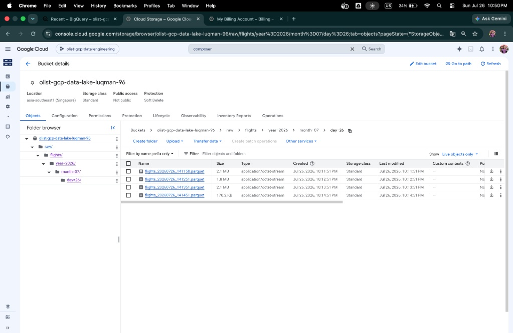
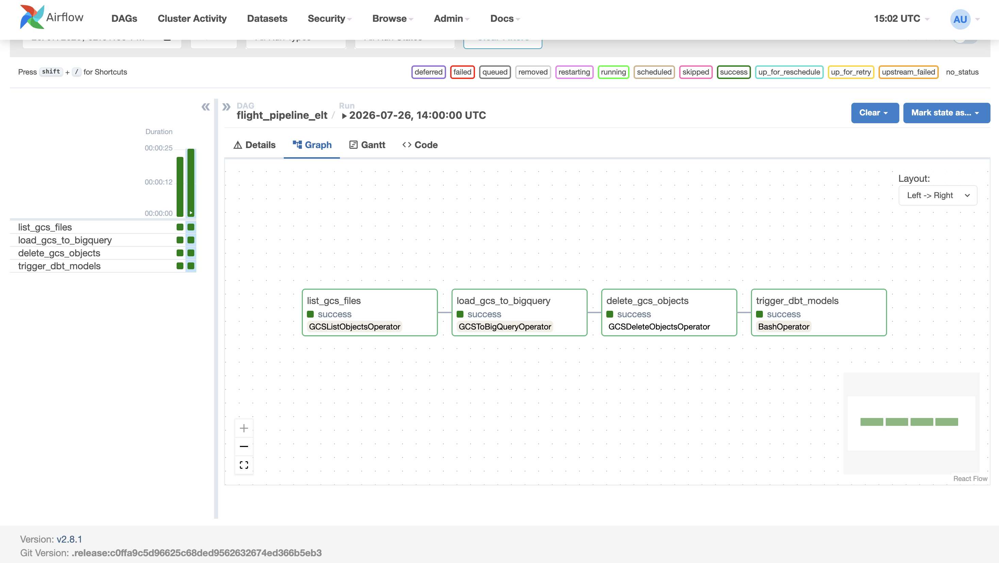
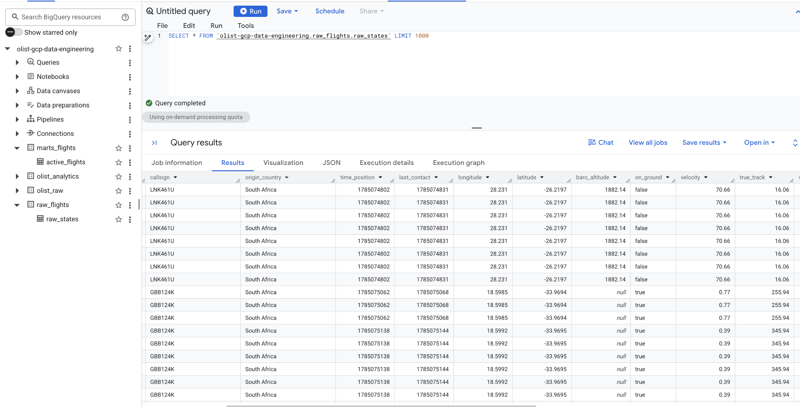
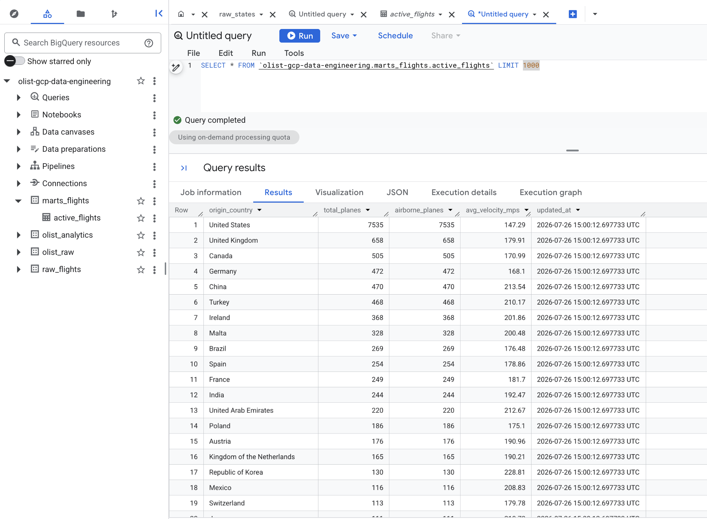

# ✈️ Live Flight Telemetry Streaming Pipeline (ELT)

An end-to-end, production-grade Streaming & Batch **ELT (Extract, Load, Transform)** data engineering pipeline. This system extracts live global aircraft telemetry vectors from the [OpenSky Network API](https://opensky-network.org/apidoc/rest.html), streams events through **Apache Kafka**, buffers Hive-partitioned Parquet files into a **Google Cloud Storage (GCS)** data lake, orchestrates warehouse loading via **Apache Airflow**, and builds analytical data marts in **Google BigQuery** using **dbt**.

---

## 🏗️ Architecture Overview

```text
===================================================================================
                         INFRASTRUCTURE AS CODE (IaC)
            Terraform provisions GCS Bucket & BigQuery Datasets
===================================================================================
                                   |
                                   v
+------------------+     +-------------------+     +--------------------+
|  OpenSky REST    | --> |  Python Producer  | --> |    Apache Kafka    |
|  API (15s Poll)  |     |  (JSON Payload)   |     |   (Flight Topic)   |
+------------------+     +-------------------+     +--------------------+
                                                             |
                                                             v
+------------------+     +-------------------+     +--------------------+
| BigQuery Warehouse| <--|  Apache Airflow   | <-- |  Python Consumer   |
| (Raw & Marts)    |     |  (Hourly Batch)   |     | (60s Parquet Sync) |
+------------------+     +-------------------+     +--------------------+
        ^                                                    |
        |               [ dbt Core Transformations ]         v
        +-------------------------------------------- [ GCS Staging Lake ]
```

The pipeline architecture is decoupled into two distinct processing planes:
1. **Streaming Ingestion Plane**: Microservices poll the OpenSky API every 15 seconds, broadcast JSON payloads into Kafka, and consume stream records into Hive-partitioned Parquet files written to GCS every 60 seconds.
2. **Batch Processing Plane**: Airflow orchestrates hourly batch ingestion of Parquet files from GCS into BigQuery `raw_flights`, purges staging GCS objects, and executes dbt transformation models to generate analytical tables in `marts_flights`.

---

## 📸 Architecture & Execution Showcase

### 1. Hive-Partitioned Data Lake (GCS Staging)
Parquet files are written to GCS using Hive-style date partitioning (`raw/flights/year=YYYY/month=MM/day=DD/flights_<timestamp>.parquet`). This structure enables fast scanning and automated schema autodetection.


*Figure 1: Hive-partitioned Parquet storage layout in Google Cloud Storage.*

---

### 2. Orchestration & Lineage (Apache Airflow)
Airflow orchestrates the batch load process via the `flight_pipeline_elt` DAG:
- **`list_gcs_files`**: Dynamically discovers landing Parquet files in GCS.
- **`load_gcs_to_bigquery`**: Executes `GCSToBigQueryOperator` to append records to `raw_flights.raw_states`.
- **`delete_gcs_objects`**: Purges ingested files from GCS to maintain an idempotent landing zone.
- **`trigger_dbt_models`**: Invokes `dbt run` and `dbt test` to construct transformation tables.


*Figure 2: Airflow DAG pipeline execution graph and task status.*

---

### 3. Raw Telemetry Ingestion Layer (BigQuery Raw Zone)
The unpolished OpenSky state vectors land in BigQuery dataset `raw_flights.raw_states` with automatic type inference.


*Figure 3: Unfiltered raw telemetry records landing in BigQuery `raw_flights.raw_states`.*

---

### 4. Transformed Analytical Datamart (BigQuery Marts)
dbt cleanses, deduplicates, and aggregates raw telemetry records into `marts_flights.active_flights`, computing total active aircraft, airborne counts, and average velocity per origin country.


*Figure 4: Aggregated datamart model in BigQuery `marts_flights.active_flights` built via dbt.*

---

## 🧰 Tech Stack & Tools

| Component | Technology | Description |
| :--- | :--- | :--- |
| **IaC** | **Terraform** | Declarative provisioning of GCS buckets and BigQuery datasets (`asia-southeast1`). |
| **Containerization**| **Docker & Compose** | Multi-container orchestration of Kafka, Postgres, Airflow, Producer, and Consumer. |
| **Event Broker** | **Apache Kafka** | KRaft-mode single-node event streaming broker (`kafka:9092`). |
| **Streaming** | **Python 3.10** | Microservices using `kafka-python`, `pandas`, and `pyarrow`. |
| **Data Lake** | **Google Cloud Storage** | Persistent object storage staging layer for compressed Parquet files. |
| **Orchestration**| **Apache Airflow 2.8**| Scheduled DAG execution, error handling, and XCom object state tracking. |
| **Data Warehouse**| **Google BigQuery** | Serverless data warehouse hosting raw landing and analytics data marts. |
| **Transformations**| **dbt-bigquery** | Modular SQL transformations, testing, and documentation generation. |

---

## 📁 Repository Directory Layout

```
opensky-elt-pipeline/
├── README.md                             # Project documentation
├── .env.example                          # Environment variables template
├── .gitignore                            # Version control exclusion rules
├── deploy.sh                             # GCP VM automated deployment script
├── docker-compose.yml                    # Multi-container orchestration specification
├── init_project.sh                       # Repository layout initialization script
├── airflow/
│   ├── Dockerfile                        # Airflow image with pre-baked dbt & GCP libraries
│   └── dags/
│       └── flight_pipeline.py            # Airflow DAG for GCS->BQ & dbt execution
├── consumer/
│   ├── Dockerfile                        # Docker build setup for consumer microservice
│   └── main.py                           # Kafka to GCS Parquet consumer script
├── producer/
│   ├── Dockerfile                        # Docker build setup for producer microservice
│   └── main.py                           # OpenSky API to Kafka producer script
├── streaming/
│   ├── producer.py                       # Python producer logic (HTTP Basic Auth & 15s poll)
│   └── consumer.py                       # Python consumer logic (Parquet typing & GCS sync)
├── dbt/
│   ├── dbt_project.yml                   # dbt configuration & model materializations
│   ├── profiles.yml                      # dbt BigQuery connection profile (asia-southeast1)
│   └── models/
│       ├── sources.yml                   # dbt raw table declaration
│       └── marts/
│           └── active_flights.sql        # Datamart SQL model aggregating active aircraft
├── docs/                                 # Screenshots and visual architecture assets
│   ├── airflow_dag.png
│   ├── bigquery_mart.png
│   ├── bigquery_raw.png
│   └── gcs_staging.png
└── terraform/
    ├── main.tf                           # GCS bucket & BigQuery dataset IaC definitions
    ├── variables.tf                      # Terraform variable definitions
    └── outputs.tf                        # Terraform output variables
```

---

## 💡 Engineering & Cost Design Highlights

1. **Near-$0 GCP Billing Footprint**:
   - Streaming records are continuously buffered and converted locally into compressed Parquet format every 60 seconds before uploading to GCS.
   - BigQuery loading runs in batch on an hourly schedule instead of continuous streaming inserts (`insertAll`), avoiding streaming API slot costs and reducing BigQuery compute fees to practically **$0.00**.

2. **Idempotence & State Safety**:
   - Airflow tracks landing Parquet objects dynamically using `GCSListObjectsOperator`. Only files successfully loaded into BigQuery are purged from GCS, ensuring zero data loss and zero duplicate ingestion upon retries.

3. **Schema Enforcement & Resiliency**:
   - `consumer.py` enforces explicit data types (`Int64`, `float64`, `string`, `boolean`) prior to Parquet serialization, guaranteeing schema compatibility during BigQuery auto-detection.
   - The producer script handles HTTP `429` rate limiting by enforcing a mandatory 15-second delay and backing off 60 seconds whenever quota thresholds are hit.

---

## 🚀 Quickstart Guide

### 1. Environment Setup
```bash
# Clone repository
git clone https://github.com/<YOUR_USERNAME>/opensky-elt-pipeline.git
cd opensky-elt-pipeline

# Configure environment variables
cp .env.example .env
# Edit .env with your GCP_PROJECT_ID and GCS_BUCKET_NAME

# Place your GCP Service Account JSON key
mkdir -p keys
cp /path/to/your-key.json keys/gcp-key.json
```

### 2. Infrastructure Provisioning with Terraform
```bash
export GOOGLE_APPLICATION_CREDENTIALS="$(pwd)/keys/gcp-key.json"
cd terraform
terraform init
terraform apply \
  -var="project_id=your-gcp-project-id" \
  -var="gcs_bucket_name=your-gcs-bucket-name" \
  -var="region=asia-southeast1"
cd ..
```

### 3. Container Orchestration
```bash
docker compose up -d --build
```

Access Airflow Web UI at **`http://localhost:8085`** *(User: `admin` / Password: `admin`)*.
